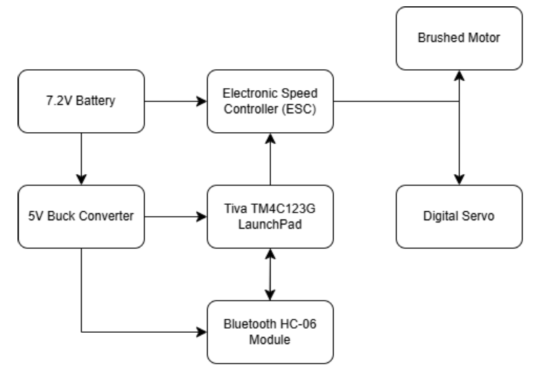
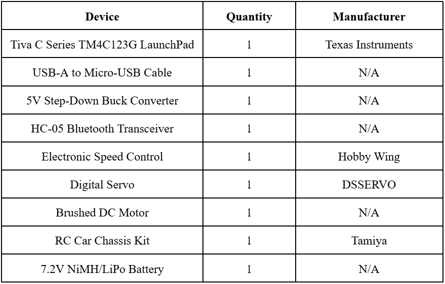
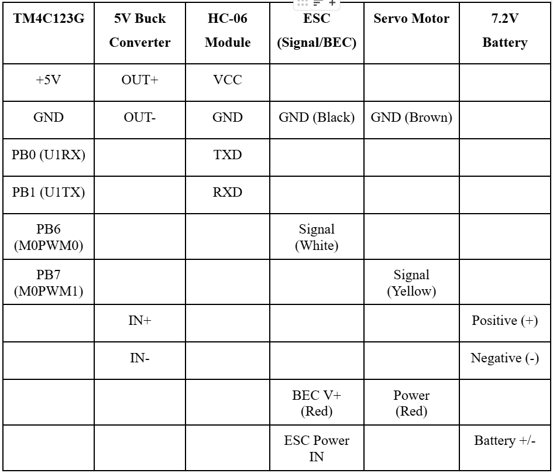

# ECE_425_Project-Andy_Ha_and_Javier_Narvaez
# Bluetooth Remote-Controlled Microcontroller Car

## Introduction
This project implements a Bluetooth-controlled RC car using the Texas Instruments TM4C123G LaunchPad microcontroller. Wireless communication is achieved through a Bluetooth serial module, while PWM signals control both the drive motor speed and steering servo. The system integrates UART communication, PWM generation, and embedded C programming to create a responsive and functional remote-controlled vehicle.

---

## Functional Block Diagram

This diagram illustrates the interaction between the TM4C123G LaunchPad, Bluetooth module, PWM-controlled motor and servo, power regulation, and user input device.

---

## Results
The RC car successfully responds to wireless commands, allowing real-time speed control and steering adjustments. UART communication remained stable at 9600 bps, and PWM outputs provided smooth motor and servo operation, as demonstrated in class.

---

## Background and Methodology
The project was developed by configuring on-chip peripherals of the TM4C123G microcontroller. UART1 was initialized to communicate with the Bluetooth module using standard serial parameters, while PWM Module 0 generated control signals for the electronic speed controller and servo motor. Power was supplied by a 7.2V battery regulated through a buck converter and the ESC’s BEC. Embedded C code handled initialization, command parsing, and real-time control logic.

---

## Embedded Systems Concepts Applied
- UART serial communication and baud rate configuration  
- PWM signal generation and duty-cycle control  
- GPIO alternate function configuration  
- Power regulation and interfacing external peripherals  
- Real-time embedded C programming

---

## Project Goals and Implementation
The primary goal was to design a wireless RC vehicle using embedded peripherals without external motor drivers. This was achieved by leveraging UART communication for command input and PWM outputs for motion control. Modular code structure and hardware abstraction ensured reliable operation and ease of future expansion.

---

## Components Used

---

## Pin Configuration

---

## References
- Texas Instruments TM4C123G LaunchPad User Guide  
- TM4C123GH6PM Datasheet  
- HC-06 Bluetooth Module Datasheet
